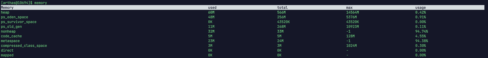

最近在设计1个功能，其中需要内存保存数据的全量索引，结构大概如下:

```java
Map<Integer,Integer> indexMap = new HashMap<>();
```

我跑单测观察这个Map占用内存的时候发现，110多万的数据要消耗500多MB内存，这个其实对内存的占用已经算是非常大了，那么就可以用标题说的Eclipse-Collection库的IntIntHashMap来替代之前的HashMap

首先我们引包:

```xml
				<dependency>
            <groupId>org.eclipse.collections</groupId>
            <artifactId>eclipse-collections-api</artifactId>
            <version>11.0.0</version>
        </dependency>

        <dependency>
            <groupId>org.eclipse.collections</groupId>
            <artifactId>eclipse-collections</artifactId>
            <version>11.0.0</version>
        </dependency>
```

然后IntIntHashMap的使用和普通Map区别不大，只不过由于确定了Key和Value都是Int，所以就不需要泛型了

```java
    @Test
    void printObjectSize2() throws InterruptedException {
        Thread.sleep(1000 * 60);
        System.out.println("begin");
        IntIntHashMap intHashMap = new IntIntHashMap();
        for (int i = 0; i < 1000000; i++) {
            intHashMap.put(i, i);
        }
        System.out.println("end");
        Thread.currentThread().join();
    }
```

执行上面的单测，begin前面的sleep是为了预留登录arthas的时间，然后通过执行`memory`观察当前堆内存大小。



然后执行到end的时候，在执行一次`memory`看下堆的大小，发现这次只占用61MB。


