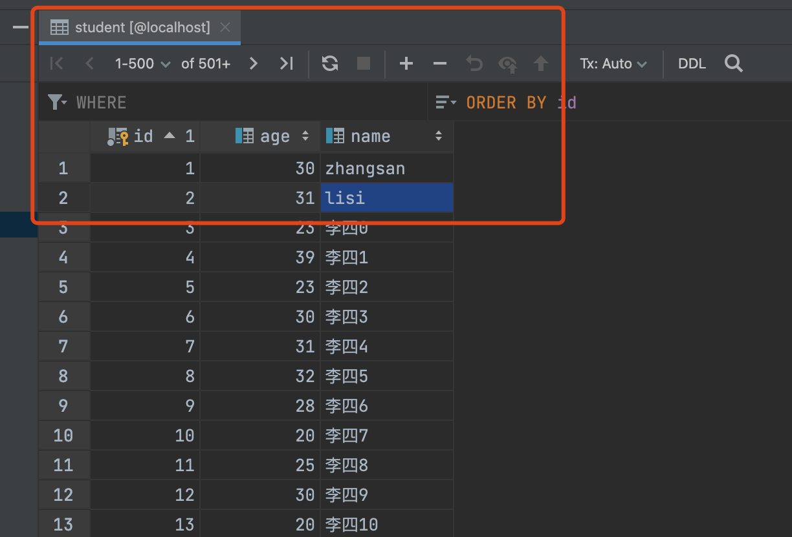
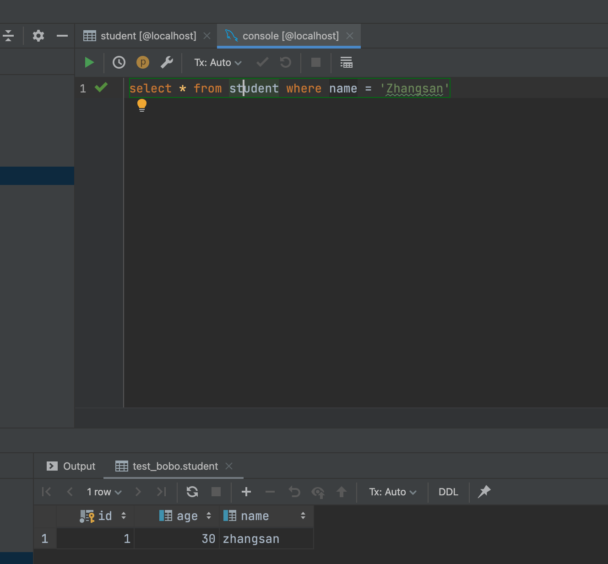
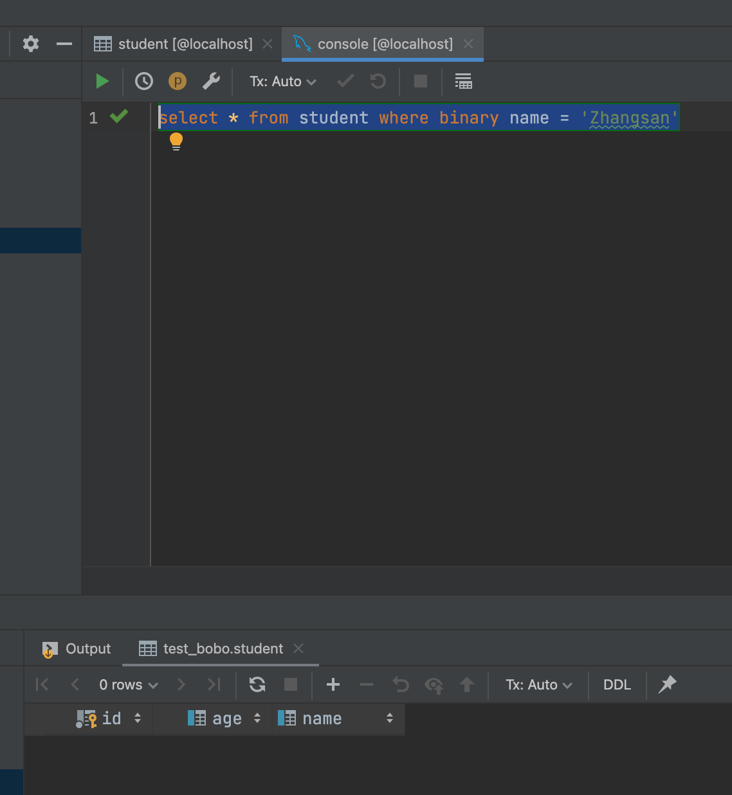

今天1个同事问我1个问题，MySQL查询如何区分大小写，当时我就惊了，难道默认不区分吗？于是我做了一下尝试，在本地建了1个表，发现还真的不区分，效果如下: 



然后我执行下面的SQL发现居然可以把zhangsan 查的到

```sql
select * from student where name = 'Zhangsan'
```

其中Z是我故意大写的，结果如下:



要想解决这个问题，可以通过`binary`关键字解决，加在列的前面

```sql
select * from student where binary name = 'Zhangsan'
```

这样就查不到了




