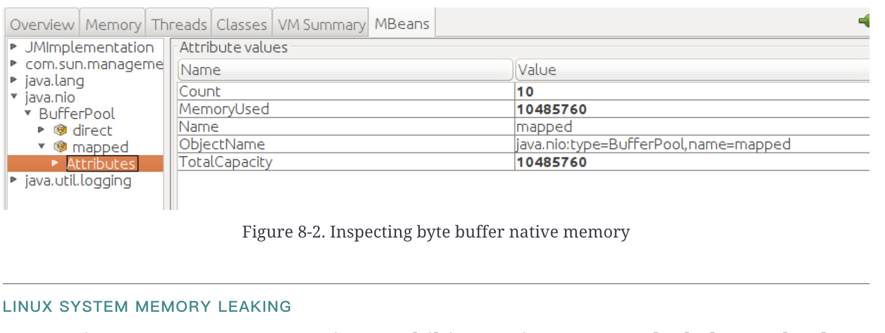

堆是Java应用程序中最大的内存消耗者，但JVM将分配和使用大量本机内存。虽然第7章从编程的角度讨论了有效管理堆的方法，但堆的配置以及它如何与操作系统的本机内存交互是影响应用程序整体性能的另一个重要因素。这里存在术语冲突，因为C程序员倾向于将其本机内存的一部分称为C堆。为了与以Java为中心的世界观保持一致，我们将继续使用堆来引用Java堆，使用本机内存来引用JVM的非堆内存，包括C堆。

本章讨论本机(或操作系统)内存的这些方面。我们首先讨论JVM的整个内存使用情况，目的是了解如何监视该使用情况以发现性能问题。然后，我们将讨论调优JVM和操作系统以优化内存使用的各种方法。

## 占用空间

堆(通常)占JVM使用的最大内存量，但JVM也使用内存进行其内部操作。这种非堆内存是本机内存。本机内存也可以在应用程序中分配(通过对Malloc()和类似方法的JNI调用，或者在使用新I/O或NIO时)。JVM使用的本机内存和堆内存的总和产生了应用程序的总占用空间。

从操作系统的角度来看，这一总占用空间是性能的关键。如果没有足够的物理内存来容纳应用程序的全部占用空间，则性能可能会开始下降。这里的关键字是可能。本机内存的一部分仅在启动期间使用(例如，与在类路径中加载JAR文件相关联的内存)，如果该内存被换出，则不一定会被注意到。一个Java进程使用的一些本机内存与系统上的其他Java进程共享，一些较小的部分与系统上的其他类型的进程共享。不过，在大多数情况下，为了获得最佳性能，您希望确保所有Java进程的总内存占用不超过机器的物理内存(另外，您还希望为其他应用程序留出一些内存)。

### 测量占用空间

要测量进程的总内存使用量，您需要使用特定于操作系统的工具。在基于Unix的系统中，`top`和`ps`等程序可以显示基本级别的数据；在`Windows`系统中，您可以使用`perfmon`或`VMMap`。无论使用哪种工具和平台，都需要查看进程的实际分配内存(而不是驻留内存)。

分配内存和保留内存之间的区别取决于JVM(和所有程序)管理内存的方式。考虑使用参数`-Xms512m`  `-Xmx2048m`指定的堆。堆从使用512MB开始，它将根据需要调整大小，以满足应用程序的GC目标。

这一概念是已提交(或已分配)内存和驻留内存(有时称为进程的虚拟大小)之间的本质区别。JVM必须告诉操作系统它可能需要多达2 GB的内存用于堆，以便驻留内存：操作系统承诺，当JVM增加堆的大小时尝试分配额外的内存时，该内存将是可用的。

尽管如此，最初只分配了512MB内存，这512MB是(堆)正在使用的所有内存。该(实际分配的)内存称为提交内存。提交的内存量将随着堆大小的调整而波动；具体地说，随着堆大小的增加，提交的内存量也相应增加。

**超额预定是个问题吗？**

当我们查看性能时，只有提交的内存才是真正重要的：性能问题从来不是由于保留太多内存而导致的。

但是，有时您希望确保JVM不会保留太多内存。对于32位JVM来说尤其如此。由于32位应用程序的最大进程大小为4 GB(或更小，具体取决于操作系统)，因此过度保留内存可能是个问题。为堆保留3.5 GB内存的JVM只剩下0.5 GB的本机内存用于堆栈、代码缓存等。如果堆扩展到只提交1 GB的内存，这并不重要：由于3.5 GB的保留，用于其他操作的内存量被限制为0.5 GB。

64位JVM不受进程大小的限制，但受机器上的虚拟内存总量的限制。假设您有一台具有4 GB物理内存和10 GB虚拟内存的小型服务器，并启动一个最大堆大小为6 GB的JVM。这将保留6 GB的虚拟内存(外加更多的非堆内存段)。无论堆变得多大(以及提交的内存有多大)，这个JVM只能在该机器上保留不到4 GB的内存。

在所有条件相同的情况下，增加JVM结构的大小并让JVM以最佳方式使用该内存是很方便的。但这并不总是可行的。

这种差异几乎适用于JVM分配的所有重要内存。随着更多代码的编译，代码缓存从初始值增长到最大值。元空间与堆分开分配，并在其初始(提交)大小和最大(保留)大小之间增长。

线程堆栈是一个例外。每次JVM创建线程时，操作系统都会分配一些本机内存来保存该线程的堆栈，从而将更多内存分配给进程(至少在线程退出之前)。不过，线程堆栈在创建时是完全分配的。

在Unix系统中，应用程序的占用空间可以通过各种操作系统工具报告的进程的驻留集大小(RSS)来估计。该值很好地估计了一个进程正在使用的已提交内存量，尽管它在两个方面并不准确。首先，JVM和其他进程之间在操作系统级别共享的少数几个页面(即共享库的文本部分)将计入每个进程的RSS。其次，一个进程在任何时刻提交的内存都可能比它调入的内存多。不过，跟踪进程的RSS是监视总内存使用的一种很好的首选方法。在较新的Linux内核上，PSS是RSS的改进，它删除了与其他程序共享的数据。

在Windows系统上，等同的概念称为应用程序的工作集，这是任务管理器报告的内容。

### 最大限度地减少占用空间

要最大限度地减少JVM使用的内存使用量，请限制以下各项使用的内存量：

:::details 堆

堆是最大的内存块，尽管令人惊讶的是它可能只占用总内存的50%到60%。使用较小的最大堆(或设置GC调优参数以使堆永远不会完全扩展)会限制程序的内存占用。

:::

:::details 线程堆栈

线程堆栈非常大，特别是对于64位JVM而言。

:::

:::details 代码缓存

代码缓存使用本机内存来保存编译后的代码。正如在第4章中所讨论的，这是可以调优的(尽管如果由于空间限制而无法编译所有代码，则性能将受到影响)。

:::

:::details 本机库分配

本机库可以分配它们自己的内存，这有时可能非常重要。

:::

接下来的几节将讨论如何监控和减少这些区域。

**快速总结**

- JVM的总内存占用对其性能有很大影响，特别是在机器上的物理内存受限的情况下。内存占用是性能测试的另一个应该通常监视的方面。

------

### 本机内存跟踪

JVM提供了有关它如何分配本机内存的有限可见性。重要的是要认识到，这种跟踪适用于由代码JVM本身分配的内存，但不包括由应用程序使用的本机库分配的任何内存。这既包括第三方本机库，也包括JDK本身附带的本机库(例如，libsocket.so)。

使用选项`-XX:NativeMemoryTracking=*off|summary|detail`可以实现这种可见性。默认情况下，本机内存跟踪(NMT)处于关闭状态。如果开启了汇总或明细模式，您可以随时从jcmd获取本机内存信息：

如果使用参数`-XX:+PrintNMTStatistics`(默认情况下为FALSE)启动JVM，则当程序退出时，JVM将输出有关分配的信息。

以下是一个JVM的汇总输出，该JVM的初始堆大小为512 MB，最大堆大小为4 GB：

```
Native Memory Tracking:

 Total: reserved=5947420KB, committed=620432KB
```

尽管JVM总共预留了5.9 GB的内存，但它使用的内存要少得多：只有620MB。这是相当典型的(这也是不特别注意操作系统工具中显示的进程的虚拟大小的原因之一，因为这只反映了内存预留)。

这种内存使用情况如下所示。堆本身(毫不奇怪)是驻留内存中最大的部分，为4 GB。但是堆的动态大小意味着它只增长到268 MB(在本例中，堆大小是-Xms256m-Xmx4g，因此实际的堆使用量只有少量扩展)：

```
-                 Java Heap (reserved=4194304KB, committed=268288KB)
                            (mmap: reserved=4194304KB, committed=268288KB)
```

接下来是用于保存类元数据的本机内存。同样，请注意，JVM保留的内存比用来容纳程序中的24,316个类的内存要多。此处的提交大小将从`MetaspaceSize`标志的值开始，并根据需要增长，直到达到`MaxMetaspaceSize`标志的值：

```
-                     Class (reserved=1182305KB, committed=150497KB)
                            (classes #24316)
                            (malloc=2657KB #35368)
                            (mmap: reserved=1179648KB, committed=147840KB)
```

分配了77个线程堆栈，每个线程堆栈大约1 MB：

```
-                    Thread (reserved=84455KB, committed=84455KB)
                            (thread #77)
                            (stack: reserved=79156KB, committed=79156KB)
                            (malloc=243KB, #314)
                            (arena=5056KB, #154)
```

然后是JIT代码缓存：24,316个类不是很多，所以只提交了一小部分代码缓存：

```
-                      Code (reserved=102581KB, committed=15221KB)
                            (malloc=2741KB, #4520)
                            (mmap: reserved=99840KB, committed=12480KB)
```

接下来是GC算法用于处理的堆之外的区域。此区域的大小取决于正在使用的GC算法：(简单的)串行收集器保留的空间将远远少于更复杂的G1GC算法(尽管一般来说，这里的保留量永远不会很大)：

```
-                        GC (reserved=199509KB, committed=53817KB)
                            (malloc=11093KB #18170)
                            (mmap: reserved=188416KB, committed=42724KB)
```

类似地，除了放置在代码缓存中的结果代码外，编译器还使用该区域进行其操作：

```
-                  Compiler (reserved=162KB, committed=162KB)
                            (malloc=63KB, #229)
                            (arena=99KB, #3)
```

JVM的内部操作在这里表示。它们中的大多数往往都很小，但有一个重要的例外是`direct byte buffers`，其分配如下：

```
-                  Internal (reserved=10584KB, committed=10584KB)
                            (malloc=10552KB #32851)
                            (mmap: reserved=32KB, committed=32KB)
```

符号表引用(来自类文件的常量)保存在这里：

```
-                    Symbol (reserved=12093KB, committed=12093KB)
                            (malloc=10039KB, #110773)
                            (arena=2054KB, #1)
```

NMT本身需要一些空间来运行(这是默认情况下不启用它的原因之一)：

```
-    Native Memory Tracking (reserved=7195KB, committed=7195KB)
                            (malloc=16KB #199)
                            (tracking overhead=7179KB)
```

最后，以下是JVM的一些次要记账部分：

```
-               Arena Chunk (reserved=188KB, committed=188KB)
                            (malloc=188KB)
-                   Unknown (reserved=8192KB, committed=0KB)
                            (mmap: reserved=8192KB, committed=0KB)
```

------

**详细的内存跟踪信息**

如果JVM以`-XX:NativeMemoryTracking=detail`启动，那么`jcmd`(带有最后一个`detail`参数)将提供有关本机内存分配的详细信息。这包括整个内存空间的映射，其中包括如下行：

```
0x00000006c0000000 - 0x00000007c0000000] reserved 4194304KB for Java Heap
        from [ReservedSpace::initialize(unsigned long, unsigned long,
                            bool, char*, unsigned long, bool)+0xc2]
        [0x00000006c0000000 - 0x00000006fb100000] committed 967680KB
            from [PSVirtualSpace::expand_by(unsigned long)+0x53]
        [0x000000076ab00000 - 0x00000007c0000000] committed 1397760KB
            from [PSVirtualSpace::expand_by(unsigned long)+0x53]
```

这4 GB的堆空间是在初始化()函数中保留的，其中两次分配是在Expand_by()函数中进行的。

这种信息会在整个进程空间中重复出现。如果您是JVM工程师，它提供了一些有趣的线索，但对于我们其他人来说，摘要信息足够有用了。

总体而言，NMT提供了两条关键信息：

:::details 提交的总大小

JVM的总提交大小(理想情况下)接近进程将消耗的物理内存量。反过来，这应该接近应用程序的RSS(或工作集)，但是那些由操作系统提供的度量不包括任何已提交但被调出进程的内存。事实上，如果进程的RSS小于提交的内存，这通常表示操作系统难以在物理内存中容纳所有JVM。

:::

:::details 个人提交大小

当需要调优堆、代码缓存和元空间的最大值时，了解JVM使用了多少内存是很有帮助的。过度分配这些区域通常只会导致无害的内存保留，尽管当保留的内存很重要时，NMT可以帮助跟踪哪些地方可以削减这些最大大小。

:::

另一方面，正如我在本节开头所指出的，NMT不提供对共享库的本机内存使用的可见性，因此在某些情况下，总进程大小将大于JVM数据结构的提交大小。

NMT随时间推移

NMT还允许您跟踪一段时间内内存分配是如何发生的。在启用NMT的情况下启动JVM后，您可以使用以下命令建立内存使用基准：

```shell
jcmd process_id VM.native_memory baseline
```

这会导致JVM标记其当前的内存分配。稍后，您可以将当前内存使用情况与该标记进行比较：

```shell
% jcmd process_id VM.native_memory summary.diff
Native Memory Tracking:

Total:  reserved=5896078KB  -3655KB, committed=2358357KB -448047KB

-             Java Heap (reserved=4194304KB, committed=1920512KB -444927KB)
                        (mmap: reserved=4194304KB, committed=1920512KB -444927KB)
```

在本例中，JVM保留了5.8 GB的内存，目前正在使用2.3 GB。承诺的大小比建立基线时减少了448 MB。类似地，堆使用的提交内存减少了444MB(可以检查输出的其余部分，以查看内存使用量减少的其他地方占剩余的4MB)。

这是一种检查JVM随时间变化的内存占用情况的有用技术。

------

**NMT自动禁用**

在NMT输出中，我们看到NMT本身需要本机内存。此外，启用NMT将创建帮助进行内存跟踪的后台线程。

如果JVM的内存或CPU资源变得非常紧张，NMT将自动关闭以节省资源。这通常是一件好事--除非你需要诊断的是紧张的情况。在这种情况下，您可以通过禁用   `-XX:-AutoShutdownNMT` NMT标志(默认情况下为`true`)来确保NMT继续运行。

------

**快速总结**

- 本机内存跟踪(NMT)提供有关JVM本机内存使用的详细信息。从操作系统的角度来看，这包括JVM堆(对于操作系统来说，它只是本机内存的一部分)。
- NMT的摘要模式足以进行大多数分析，并允许您确定JVM已经提交了多少内存(以及该内存用于什么)。

------

### 共享库本机内存

从体系结构的角度来看，NMT是HotSpot的一部分：运行应用程序的Java字节码的C++引擎。这是在JDK本身之下的，因此它不在JDK级别跟踪任何东西的分配。这些分配来自共享库(由`System.loadLibrary()`调用加载的库)。

共享库通常被认为是Java的第三方扩展：例如，Oracle WebLogic Server有几个本机库，它使用它们比JDK更有效地处理I/O。但JDK本身有几个本机库，与所有共享库一样，这些库都不在NMT的视野中。

因此，NMT通常不会检测到本机内存泄漏--即应用程序的RSS或工作集不断超时增长。NMT监控的内存池通常都有一个上限(例如，最大堆大小)。NMT在告诉我们哪些池正在使用大量内存(因此哪些需要调优以使用更少的内存)方面很有用，但是不加绑定地泄漏本机内存的应用程序通常是因为本机库中的问题而这样做的。

没有Java级别的工具可以真正帮助我们检测应用程序正在使用共享库中的本机内存的位置。操作系统级别的工具可以告诉我们，进程的工作集正在不断增长，如果进程增长到有10 GB的工作集，而NMT告诉我们JVM只分配了6 GB的内存，我们就知道其他4 GB的内存必须来自本地库分配。

找出哪个本地库负责需要操作系统级别的工具，而不是来自JDK的工具。各种调试版本的`malloc`可用于此目的。这些在一定程度上是有用的，尽管本机内存通常是通过`mmap`调用来分配的，而大多数用于跟踪`malloc`调用的库都会错过这些。

一个很好的替代方案是一个分析器，它可以分析本机代码和Java代码。例如，在第3章中，我们讨论了Oracle Studio Profiler，这是一个混合语言的Profiler。该分析器还具有跟踪内存分配的选项--需要注意的是，它只能跟踪本机代码的内存分配，而不能跟踪Java代码的内存分配，但这正是我们在本例中要考虑的问题。

图8-1显示了Studio Profiler中的本机分配视图。


这个调用图向我们展示了WebLogic本机函数`mapFile`已经使用`mmap`为我们的进程分配了大约150 GB的本机内存。这有点误导：存在到该文件的多个映射，而分析器不够智能，无法意识到它们共享的是实际内存：例如，如果15 GB文件有100个映射，则内存使用量仅增加15 GB。(坦率地说，我故意破坏了该文件，使其变得如此大；这根本不能反映实际使用情况。)尽管如此，本地分析器已经指出了问题的位置。

在JDK本身内，有两个常见的操作可能会导致大量本机内存使用：使用`Inflater`和`Deflater`对象，以及使用NIO缓冲区。即使不进行性能分析，也有方法可以检测这些操作是否导致本机内存增长。

#### 本地内存和inflaters/deflaters

`inflaters`和`deflaters`执行各种压缩：ZIP、GZIP等。它们可以直接使用，也可以通过各种输入流隐式使用。这些不同的算法使用特定于平台的本地库来执行它们的操作。这些库可以分配大量的本机内存。

当您使用这些类中的一个时，正如文档所述，您应该在操作完成时调用`end()`方法。除其他事项外，这还释放了对象使用的本机内存。如果您正在使用流，则应该关闭流(并且流类将在其内部对象上调用`end()`方法)。

如果您忘记调用`end()`方法，也不会失去一切。回想一下第7章，所有对象都有一个完全针对这种情况的清理机制：在收集`Inflater`时，与对象相关联的`finalize()`方法(在JDK 8中)或`Cleaner`(在JDK 11中)可以调用`end()`方法。因此，您不会在这里泄漏本机内存；最终，对象将被收集并最终确定，本机内存将被释放。

不过，这可能需要很长时间。`Inflater`的大小相对较小，并且在具有很少执行完整GC的大堆的应用程序中，这些对象很容易升级到老一代并停留几个小时。因此，即使在技术上没有泄漏-当应用程序执行完整的GC时，本机内存最终将被释放-在这里调用`end()`操作的失败可能具有所有本机内存泄漏的表现。

在这个问题上，如果`Inflater`本身在Java代码中泄漏，那么本机内存实际上也会泄漏。

因此，当大量本机内存泄漏时，获取应用程序的堆转储并查找这些`Inflater`和`deflaters`会很有帮助。这些对象很可能不会在堆本身中引起问题(它们太小了，不适合堆)，但它们中的大量对象将表明存在大量的本机内存使用。

#### 本地NIO缓冲

如果NIO字节缓冲区是通过`ByteBuffer`类的`allocateDirect()`方法或`FileChannel`类的`map()`方法创建的，则它们将分配本机(堆外)内存。

从性能角度来看，`Native ByteBuffer`很重要，因为它们允许本机代码和Java代码共享数据，而无需复制数据。用于文件系统和套接字操作的缓冲区是最常见的示例。将数据写入本机NIO缓冲区，然后将该数据发送到通道(例如，文件或套接字)，不需要在JVM和用于传输数据的C库之间复制数据。如果改为使用堆字节缓冲区，则必须由JVM复制缓冲区的内容。

`allocateDirect()`方法调用的开销很大；应该尽可能多地重用直接字节缓冲区。理想的情况是，当线程是独立的，并且每个线程都可以保留一个直接的字节缓冲区作为线程局部变量时。如果许多线程需要不同大小的缓冲区，这有时会使用过多的本机内存，因为最终每个线程都会得到一个最大可能大小的缓冲区。对于这种情况--或者当线程本地缓冲区不适合应用程序设计时--直接字节缓冲区的对象池可能更有用。

也可以通过对字节缓冲区进行切片(Slice)来管理它们。应用程序可以分配一个非常大的直接字节缓冲区，并且各个请求可以使用ByteBuffer类的Slice()方法从该缓冲区中分配一部分。当片的大小不总是相同时，此解决方案可能会变得笨拙：原始字节缓冲区可能会变成碎片，就像分配和释放不同大小的对象时堆会变成碎片一样。然而，与堆不同的是，字节缓冲区的各个片不能被压缩，因此只有当所有片的大小都一致时，该解决方案才能很好地工作。

从调优的角度来看，使用这些编程模型要实现的一件事是，应用程序可以分配的直接字节缓冲区空间量可以受到JVM的限制。可分配给直接字节缓冲区的内存总量通过设置`-XX:MaxDirectMemorySize=*N*`标志来指定。在当前JVM中，此标志的缺省值为0。该限制的含义一直是频繁更改的主题，但在Java 8的更高版本(以及Java 11的所有版本)中，最大限制等于最大堆大小：如果最大堆大小为4 GB，您还可以在直接和/或映射字节缓冲区中创建4 GB的堆外内存。如果需要，您可以将该值增加到超过最大堆值。

分配给直接字节缓冲区的内存包括在NMT报告的内部部分；如果该数字很大，则几乎总是因为这些缓冲区。如果您想确切地知道缓冲区本身消耗了多少，mBeans会对此进行跟踪。检查mbean `java.nio.BufferPool.direct.Attributes`或`java.nio.BufferPool.mappd.Attributes`将显示每种类型已分配的内存量。图8-2显示了一个例子，其中我们映射了10个缓冲区，总计10MB的空间。



由于内存分配库的设计，大型Linux系统有时会出现本机内存泄漏。这些库将本机内存划分为分配段，这有利于由多个线程进行分配(因为它限制了锁争用)。

但是，本机内存的管理方式与Java堆不同：尤其是，本机内存永远不会被压缩。因此，本机内存中的分配模式可能会导致与第5章中描述的相同的碎片。

Java中的本机内存可能会因为本机内存碎片而耗尽；这种情况最常发生在较大的系统上(例如，具有八个以上内核的系统)，因为Linux中的内存分区数是系统内核数的函数。

有两件事可以帮助诊断这个问题：首先，应用程序将抛出一个OutOfMemoyError，说明它耗尽了本机内存。其次，如果您查看该进程的smaps文件，它将显示许多小的(通常为64 KB)分配。在这种情况下，补救方法是将环境变量MALLOC_ARENA_MAX设置为一个小数字，如2或4。该变量的默认值是系统上的内核数乘以8(这就是问题在大型系统上更常见的原因)。在这种情况下，本机内存仍将是碎片，但碎片应该不会那么严重。

**快速总结**

- 如果一个应用程序似乎使用了太多的本机内存，那么它很可能来自本机库，而不是JVM本身。
- 本地配置文件可以有效地确定这些分配的来源。
- 几个常见的JDK类通常会导致本机内存使用；请确保正确使用这些类。

------

## 针对操作系统的JVM调优

JVM可以使用多个调优来改进其使用操作系统内存的方式。

### 大页

关于内存分配和交换的讨论以页为单位进行。页面是操作系统用来管理物理内存的内存单位。它是操作系统的最小分配单位：当分配1个字节时，操作系统必须分配整个页面。对该程序的进一步分配来自同一页，直到它被填满，此时将分配新的页。

操作系统分配的页面比物理内存所能容纳的页面多得多，这就是为什么有分页：地址空间的页面被移入和移出交换空间(或其他存储，取决于页面包含的内容)。这意味着这些页面和它们当前存储在计算机RAM中的位置之间必须有某种映射。这些映射有两种处理方式。所有页面映射都保存在全局页表中(操作系统可以扫描该表以找到特定的映射)，而最常用的映射保存在转换后备缓冲区(TLB)中。TLB保存在快速缓存中，因此通过TLB条目访问页面比通过页表访问要快得多。

机器的TLB条目数量有限，因此最大限度地提高TLB条目的命中率变得很重要(它充当最近最少使用的缓存)。由于每个条目代表一页内存，因此增加应用程序使用的页大小通常是有利的。如果每个页面代表更多的内存，则需要更少的TLB条目来包含整个程序，并且更有可能在需要时在TLB中找到页面。一般来说，这对任何程序都是正确的，对于Java应用程序服务器或其他具有中等大小堆的Java程序也是如此。

必须同时在Java和OS级别启用大页面。在Java级别，`-XX:+UseLargePages`标志启用大页面使用；默认情况下，该标志为FALSE。并不是所有的操作系统都支持大页面，启用它们的方式显然各不相同。并不是所有的操作系统都支持大页面，启用它们的方式显然各不相同。

如果在不支持大页面的系统上启用了`UseLargePages`标志，则不会给出警告，并且JVM使用常规页面。如果在确实支持大页面的系统上启用了`UseLargePages`标志，但没有大页面可用(因为它们已全部在使用中或操作系统配置错误)，则JVM将打印一条警告。

### Linux巨型(大)页面

Linux将大页面称为巨型页面。Linux上巨大页面的配置因版本而异；有关最准确的说明，请参考您的发行版的文档。但一般程序如下：

1. 确定内核支持哪些巨大的页面大小。该大小基于计算机处理器和内核启动时给定的引导参数，但最常见的值为2 MB：

```shell
# grep Hugepagesize /proc/meminfo
Hugepagesize:       2048 kB
```

2. 计算出需要多少大页面。如果JVM将分配一个4 GB的堆，并且系统有2 MB的巨大页面，那么该堆将需要2,048个巨大的页面。可以使用的巨大页面的数量是在Linux内核中全局定义的，因此对将运行的所有JVM(以及将使用巨大页面的任何其他程序)重复此过程。您应该将这个值高估10%，以说明大型页面的其他非堆使用(因此，这里的示例使用2,200个大型页面)。

3. 将该值写入操作系统(以便立即生效)：

```shell
# echo 2200 > /proc/sys/vm/nr_hugepages
```

4. 将该值保存在`/etc/sysctl.conf`中，以便在重新启动后保留该值：

```properties
sys.nr_hugepages=2200
```

5. 在许多版本的Linux上，用户可以分配的巨大页面内存量是有限的。编辑/etc/security/limits.conf文件，并为运行您的JVM的用户(例如，在本例中为用户appuser)添加成员锁条目：

```
appuser soft    memlock        4613734400
appuser hard    memlock        4613734400
```

如果修改了limits.conf文件，则用户必须重新登录才能使值生效。此时，JVM应该能够分配必要的大页面。要验证它是否正常工作，请运行以下命令：

```shell
# java -Xms4G -Xmx4G -XX:+UseLargePages -version
java version "1.8.0_201"
Java(TM) SE Runtime Environment (build 1.8.0_201-b09)
Java HotSpot(TM) 64-Bit Server VM (build 25.201-b09, mixed mode)
```

该命令的成功完成表明巨大的页面配置正确。如果超大页面内存配置不正确，则会给出警告：

```shell
Java HotSpot(TM) 64-Bit Server VM warning:
Failed to reserve shared memory (errno = 22).
```

程序在这种情况下运行；它只是使用常规页面，而不是大页面。

### Linux透明巨型页面

从2.6.32版开始的Linux内核支持透明的巨大页面。它们(理论上)提供了与传统巨型页面相同的性能优势，但它们与传统巨型页面有一些不同。

首先，传统的大页面被锁定在内存中；它们永远不能交换。对于Java来说，这是一个优势，因为正如我们已经讨论过的，交换堆的一部分不利于GC性能。透明的巨大页面可能会被交换到磁盘，这不利于性能。

其次，透明巨型页面的分配也与传统的巨型页面有很大不同。传统的巨大页面在内核引导时被搁置；它们始终可用。透明的巨大页面是按需分配的：当应用程序请求2 MB的页面时，内核将尝试在物理内存中为该页面找到2 MB的连续空间。如果物理内存是碎片化的，内核可能会决定花时间在一个类似于Java堆中的内存压缩的过程中重新安排页面。这意味着分配页面的时间可能要长得多，因为它需要等待内核完成为内存腾出空间。

这会影响所有程序，但对于Java，它可能会导致非常长的GC暂停。在GC期间，JVM可能决定扩展堆并请求新页面。如果页面分配花费几百毫秒甚至一秒，GC时间就会受到很大影响。

第三，透明的巨型页面在操作系统和Java级别上的配置都不同。具体内容如下。

在操作系统级别，通过更改/sys/core/mm/transparent_hugepage/enabled的内容来配置透明巨型页面：

```shell
# cat /sys/kernel/mm/transparent_hugepage/enabled
always [madvise] never
# echo always > /sys/kernel/mm/transparent_hugepage/enabled
# cat /sys/kernel/mm/transparent_hugepage/enabled
[always] madvise never
```

这里的三个选项如下：

:::details always

在可能的情况下，所有程序都会有很大的页面。

:::

:::details madvise

请求巨大页面的程序会被提供给它们；其他程序则会获得常规的(4KB)页面。

:::

:::details never

没有程序会得到很大的页面，即使当他们请求它们时也是如此。

:::

不同版本的Linux对该设置有不同的缺省值(它可能会在未来的版本中更改)。例如，Ubuntu 18.04 LTS将缺省值设置为`madvise`，但CentOS 7(以及基于此的Red Hat和Oracle Enterprise Linux等供应商版本)将其设置为`Always`。还要注意，在云计算机上，OS镜像的供应商可能已经更改了该值；我看到Ubuntu镜像也将该值设置为`Always`。

如果将该值设置为`Always`，则不需要在Java级别进行配置：将为JVM提供巨大的页面。事实上，在该系统上运行的所有程序都将在巨大的页面中运行。

如果将该值设置为`madvise`，并且您希望JVM使用大型页面，请指定`UseTransparentHugePages`标志(默认情况下为`FALSE`)。然后，当JVM分配页面并获得巨大的页面时，它将发出适当的请求。

可以预见的是，如果将该值设置为`Never`，则任何Java级参数都不会允许JVM获得巨大的页面。然而，与传统的大页面不同，如果您指定了`UseTransparentHugePages`标志，并且系统无法提供它们，则不会给出警告。

由于透明巨型页面在交换和分配方面的不同，通常不建议在Java中使用它们；当然，使用它们可能会导致不可预测的暂停时间峰值。另一方面，特别是在默认情况下启用它们的系统上，您将在使用它们的大部分时间内透明地看到性能优势。但是，如果您想确保在大型页面中获得最流畅的性能，最好将系统设置为仅在请求时使用透明的大型页面，并配置传统的大型页面以供JVM使用。

## 总结

尽管Java堆是最受关注的内存区域，但JVM的整个占用空间对其性能至关重要，尤其是与操作系统相关的性能。本章中讨论的工具允许您跟踪随时间变化的内存占用情况(最重要的是，将重点放在JVM的已提交内存而不是驻留内存上)。

JVM使用OS内存的某些方式--尤其是大页面--也可以调优以提高性能。长时间运行的JVM几乎总是能从使用大页面中受益，尤其是在它们拥有大堆的情况下。
