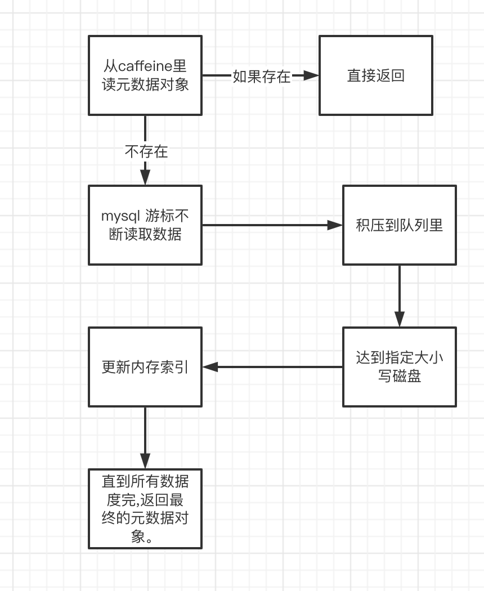

## 背景

最近工作中需要做1个很有意思并且有一定挑战的事情，项目里有1个接口，如果是第一次查询，会一次性查整个表的所有数据，然后缓存在JVM内部，后续的搜索就都会查这个缓存，这个方案肯定是不合理的，但是未来也是有计划迁移到另外1个替代它的项目上，但是在迁移之前，领导叫我临时性的做下内存优化，避免在迁移之前系统因内存不足发生崩溃或者频繁Full GC之类的问题。

## 整体实现思路

首先粗粒度的说下大体实现思路, 为了描述清楚，我直接用表格的方式去对比新老实现之前的区别

| 老实现                                      | 新实现                                                       |
| ------------------------------------------- | ------------------------------------------------------------ |
| 初始化缓存数据是直接select 全表到Caffeine里 | 是通过游标的方式不断读取部分数据，追加写入到本地文件         |
| Caffeine里存储整个表的全量数据以及索引数据  | Caffine里只存储索引数据以及表里部分热数据。                  |
| hash 索引 + entity索引                      | 在老实现基础上，增加1个ID索引并映射要修改的值和文件的Offset  |
| 更新缓存和更新DB是分开的，会存在一致性问题  | 通过读写锁的方式，对更新DB和更新缓存套1个写锁，缓存内部搜索加读锁，避免一致性问题。 |

通过以上表格对比，这里在说明下新老实现的思路

1. 老实现是一次性select全表到内存，并维护了2个额外的索引，1个是Hash索引，1个是Entity索引，由于全量数据和索引都在内存里，所以内存压力较大。
2. 新实现是利用局部数据的思想，以游标的方式读表里数据，最终内存里缓存的是全量的索引数据，但是不涉及表的原始数据，所以比较节省内存。

## 实现细节

### 初始化缓存

新实现在缓存的设计上分了2个独立的`Caffine`对象，用于缓存不同类型的数据，1个是缓存的元数据对象，另外1个是缓存的热数据，我们这里先来看在初始化缓存元数据的时候都做了哪些细节上的设计。

在缓存对外暴露的几个接口里，无论是读还是写，在第一行，都会通过`caffeine`去获取缓存元数据对象，如果取不到就会触发回调加载的逻辑，而在回调的里面就是之前说的，通过游标的方式去分页加载数据。

为什么用游标的方式是因为我们的`MYSQL`的事实表是没有ID的，主键是所有维度列组合在一起的联合索引（数量一般在七八个左右），所以我没办法按以前优化分页的逻辑用ID去卡，也没有时间列，更不可能去写普通的分页查询（那样会有深分页性能问题），所以这里选择了游标的方式去读数据。整个初始化缓存的流程大概如下图所示：



读完数据首先要做的事是为每一条数据有序生成1个ID，这样做的目的是为了后续搜索的时候，实现顺序读，减少磁盘IO次数。

接下来就是要写磁盘，然后更新内存的索引，那么首先在写磁盘的时候，就不能一条1条数据循环调用文件的API去写磁盘，那样性能太差，假设如果有100万数据，相当于我要调用100万次write方法去写入，这块的性能我也简单做了下测试，比如说一次写1w条数据跟一次写1条，其实花费的时间并不是太大，可是如果一次写1w条，那么总IO次数确少了很多，所以这也是之前学习看各种资料的时候，都建议我们要批量写，要顺序写。

上图也提到了，由于我们是达到指定数据大小，然后顺序写磁盘，那么当写完磁盘更新内存索引的时候就没办法做到每个ID映射1个数据的offset, 1开始我以为这样不好，没办法精确搜索具体的数据，后来想想，这其实也是好事，因为就跟之前说写1条和写1w条数据对比一样，读也是一次性多读一些数据，并不会造成太大的性能影响，相反结合热数据缓存，下次再做搜索的时候，就可以利用上缓存去提升性能。

另外还有2个好处，在说明之前，我先说下ID和Offset索引大概是个什么样子，比如说我们有189000条数据，我们全局指定配置按5w条数据写一次磁盘，那么`idOffsetMap` 的数据大概会是这样

| KEY    | VALUE |
| ------ | ----- |
| 50000  | 12345 |
| 100000 | 23456 |
| 150000 | 34567 |
| 189000 | 45678 |

以上数据就是idOffsetMap的数据，其中Value的部分不用关心，是我随便写的，主要看Key，因为我们是5W条数据写一次磁盘，那么除了最后一个key以外，其余的部分每个Key的间隔都是5w，那么假设我实际要搜索的数据ID 为 [51234,53486,178900,180000]

那么前2个ID会命中5w- 10w 这个区间，而后面2个ID会命中到15w-189000 这个区间，也就是说我只需要通过2次IO，就能读到我要搜索的全部数据。这是好处其中之一。

那么如果我把上面搜索的ID数组修改一下为[51234,53486,118900,120000], 那么我们会发现，命中的2个区间是连续的，这个时候通过`FileChannel`的API，就可以以一次IO的方式读取，而不是多次IO。（为了减少IO次数实现顺序读，后续在查询部分会说）。

除了`idOffsetMap`以外，还会有如下几个索引结构以及缓存数据的结构:

1. hashIndexMap
2. entityIndexMap
3. cubeDataValueMap
4. lastPageBuffer
5. hashConflictDataMap
6. hotPageIdList

上面这几个结构里 `hashIndexMap` 和 `entityIndexMap` 在老版本的缓存里也都有，`hashIndexMap`里的Hash 是根据1条数据的所有维度列的值按顺序拼到一起然后通过BKDR的Hash算法算出来的，目的用来快速判断1条数据缓存是否存在。`entityIndexMap` 就是entity成员的值和ID列表的映射，在老版本缓存里由于不需要操作磁盘，所以那时候没有ID的概念，就是Hash映射原始数据，Entity映射Hash。

`cubeDataValueMap` 这个结构是为了提高更新的速度，因为在我们的场景，update 和 delete 都是可以简单理解为对1个decimal类型的字段做更新，delete实际就是设置为NULL。那么为了避免在实际写操作的时候去写磁盘，所以需要有1个Map 去保存ID和Value 的映射关系，修改的时候只改内存，查询的时候在用内存里的value 和搜索命中的结果做合并。

`lastPageBuffer` 表示的是`idOffsetMap`里最后一部分区间的原始数据集合，它存在的意义有2个：

1. 提高insert数据到缓存的性能，避免每次插入新数据时，都要去执行`filechannel.write` （并且由于之前一次写的是1批数据，是个List结构，所以追加数据前，还需要把最后一块读出来，内存里add ,在写回去。）
2. 提高搜索性能，如果搜索命中的区间是最后1个区间，或者说我们事实表数据量本身很小，可能就只有这1个区间，那么数据就会跟之前一样全量缓存在内存里。

`hashConflictDataMap` 表示的是hash冲突时的原始数据和id的映射(不包含这个hash值下添加的第一条数据)，这个结构的作用是为了hash搜索时去提速用的，想象一下：我们要判断1条数据是否在缓存里存在，首先要计算这个数据所有维度列拼在一起的Hash值，然后命中到Hash索引上，如果这个索引里，这个Hash值映射了3个ID，那么我就可以优先判断后2个数据是否有我要搜索的结果（因为后2个ID的原始数据存在了`hashConflictDataMap`里），如果有就可以直接返回，没有的话，才需要去读取第一个ID进行搜索。由于考虑到实际hash冲突的结果不会太多，所以这部分数据也直接存在了内存里。另外在其他搜索场景里，如果ID在这个结构里作为Key存在，也会优先从这里查。

最后1个`hotPageIdList` 也是为了搜索加速产生的结构，在搜索的时候，会根据搜索的条件通过内存中的索引，得到搜索的ID数组，而这些ID数组，就会计算出分别命中了哪些区间，而在读取这个区间里数据的时候，实际也是通过`caffine`去读取的，如果或许在查询同1个区间，就会命中缓存，而这个结构存储的是具体的区间ID（也就是pageId,代码里都是以page命名），好方便在清除缓存的时候，根据这里存的区间ID进行拼接缓存Key，把这些原始数据缓存Key也同步清理掉。还拿上面举的`idOffsetMap`的数据做例子，那么的值就是 50000、100000、150000、189000 这样的值。

最后在说一个细节就是，这里的`Map`和`List`，我大量使用了`eclipse-collection`里的结构，底层保存的都是int 数组，避免使用传统JDK原生的集合导致的装箱，浪费内存，实测内存能节省将近10倍。

### 搜索

搜索的时候，首先要判断，是否能命中索引，如果命中不了，就会根据`idOffsetMap` 里存的offset直接循环搜索文件，然后内存过滤，就没什么好说的，我们这里主要说下命中索引的场景。

如果能命中索引，那么最终我们就会得到1个搜索的id数组，之前也说过，会根据这个id的数组去计算搜索的区间，现在这里说下具体的细节

1. 首先判断搜索的ID，是否在`hashConflictDataMap` 里存在，如果存在，直接从这里查
2. 然后判断搜索的ID如果是在最后1个区间，那么直接内存搜索就好了。这里面还有1个很有意思的点就是，我们可以直接根据ID去算出它在`lastPageBuffer`的index,然后直接`list.get` 就好了，算法大概如下 `(id % pageLoadSize) - 1` , 这里的pageLoadSize 就是之前我们积攒多少数据写一次磁盘以及`idOffsetMap`里区间之间的间隔，-1 是因为索引是从0开始。比如说如果我要搜索的ID是:178900 ,那么算出的index 就是 28899 。
3. 然后剩下的搜索ID数组，就是需要去计算区间的，计算区间的目的之前也讲过，是为了最大限度实现顺序IO，它的结构如下:

```java
IntObjectHashMap<IntObjectHashMap<IntArrayList>> 
```

以上是`eclipse-collections` 的声明，如果用`Java`内置的结构表示那么就是:

```java
Map<Integer,Map<Integer,List<Integer>>>
```

首先最外层的Key表示的是连续读取区间的起始区间ID，里面的`Map`表示的是，每个区间ID和要搜索的ID列表的映射。这里用`eclipse-collections`去实现，也是为了避免装箱，导致过多的内存占用。

有了这个接口，我就可以遍历上面`Map`的每个Key，然后用子`Map`里所有key 的集合去拼`caffeine`里热数据的缓存Key集合，然后一起传给`caffeine`，在`caffeine`的内部会帮我们判断，只有在key对应的数据在缓存里不存在的时候才会走到缓存的回调函数里，进行实际数据的IO查询。而也是由于`caffeine`做了这个事情，会导致1个问题，之前我们计算好连续的页，可能不连续了，比如说假设之前搜索的ID列表命中了5w-10w,10w-15w,15w-20w,20w,-25w 这几个区间，那么如果说15w-20w数据本身在缓存里存在，那么走到回调函数的Key，就只有5w-10w,10w-15w,20w,-25w 这3个区间了，也就没办法利用FileChannel的API做一次IO的读取，所以这里，我们必须要再次做一遍连续期间的计算分组，为了节省内存，这里计算的结果是1个`int[][]`的二位数组，外层表示分组，里面表示连续的区间ID。然后再循环这个二位数组，去进行文件的读取，以实现最大化顺序IO的效果。

### 优化杂项

#### 定位搜索区间

由于数据除了最后1个区间，前几个间隔都是固定的，所以可以直接用 如下公式计算到大于ID里最小ID的区间index, 然后这个区间ID和上一个区间ID组成的范围里就一定包含ID这条数据。`pageLoadSize` 之前说过就是`idOffsetMap`里的区间间隔。

```
index = id / pageLoadSize
```

#### 计算搜索区间的大小

这里有2种情况

1. 如果区间`id ==  pageLoadSize` ，那么就是第一页，`idOffsetMap.get(id)` 就是要搜索区间的大小
2. 否则就是`idIndexMap.get(id) - idIndexMap.get(id - pageLoadSize)` 表示的是ID表示的当前页的offset - 上一页的offset

由于最后一页的搜索是直接在`lastPageBuffer`里搜，所以不需要考虑最后一页的问题。

#### 缓存的设计

在热的期间原始数据缓存里，我刻意对caffine调用了`softValues` 方法，以软引用的方式避免热数据不会导致JVM内存爆炸。

在做这个设计之前，我查过相关资料，其实caffeine作者是不建议通过软引用的方式驱逐Key,除了这样目前也没有太好的办法来去做这个事情，因为caffeine只能设置最大的Key的数量，但是设置不了最大占几个G的内存，而我又不好根据Key的大小去预估最多能存多少Key。

软引用的方式我实际有做过测试，当内存满的时候，会主动触发Key的驱逐，不会导致内存爆掉。

#### 锁的策略

之前由于更新DB和更新缓存是独立控制的，所以无法保证数据的一致性，可能会发生更新完DB，缓存还没来得及更新的时候，另外1个线程读到了缓存的旧数据发生BUG。

在这次的实现里通过Java8的`StampedLock` 实现读写锁的控制，之所以用`StampedLock` 是考虑它支持乐观读，性能应该会高一些。

具体加锁的策略是，缓存内部只加读锁，写锁由外部调用控制，把更新DB和更新缓存锁在一起，这样当发生写的时候，读请求会阻塞，直到写操作完事，这样可以保证我们读到的数据是一个一致性的数据，不会发生比如说`hashIndexMap`是更新后的但是`idOffsetMap`是更新前的。

