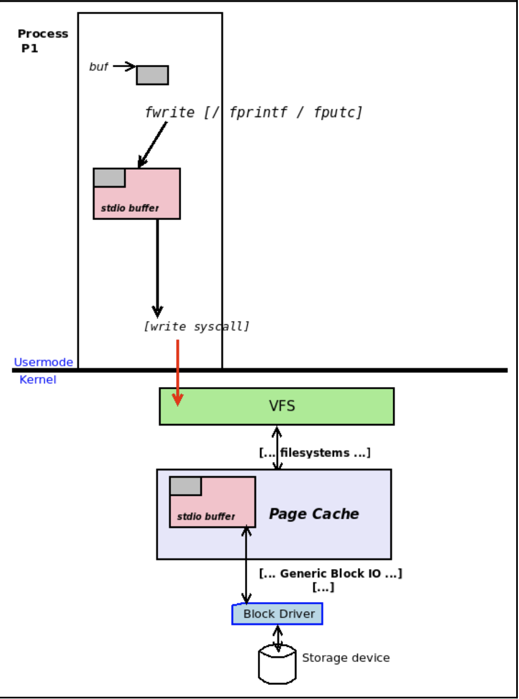
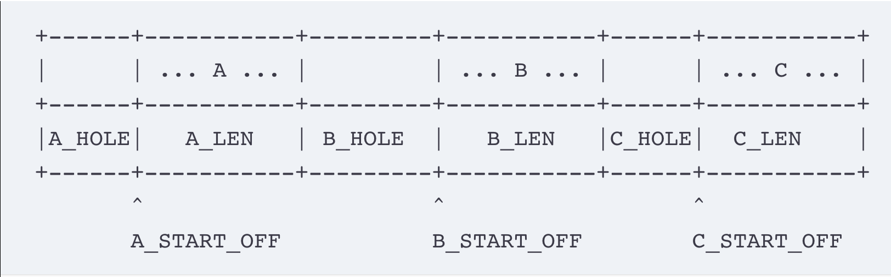
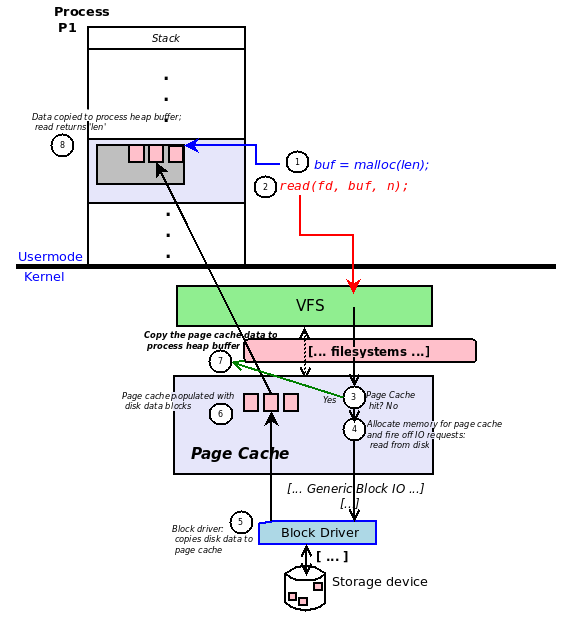
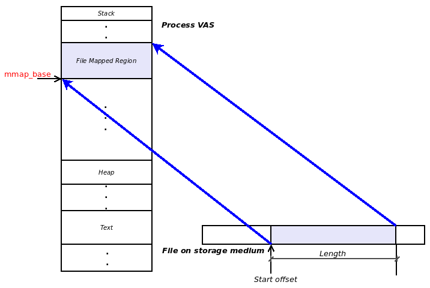
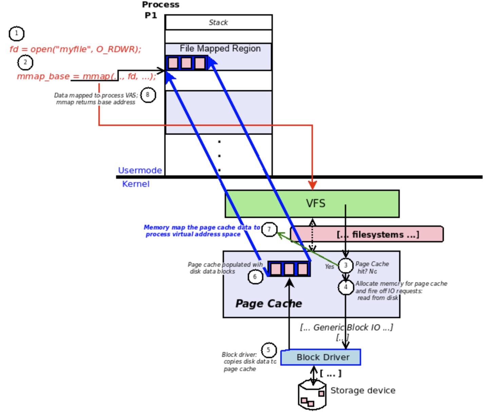

通常，人们会对CPU及其性能感到紧张。虽然很重要，但在许多实际应用程序工作负载中，拖累性能的不是CPU，而是I/O代码路径。这是完全可以理解的；回想一下，在第2章-虚拟内存中，我们展示了与RAM相比，磁盘速度慢了几个数量级。这种情况与网络I/O类似；因此，由于大量持续的磁盘和网络I/O，自然会出现真正的性能瓶颈。

在本章中，读者将学习几种提高I/O性能的方法；一般而言，这些方法包括：

- 充分利用内核PageCache
- 向内核提供有关文件使用模式的提示和建议
- 使用`scatter-gather`(向量化)I/O
- 利用内存映射进行文件I/O
- 了解和使用复杂的DIO和AIO技术。
- 了解I/O调度程序
- 用于监视、分析和控制I/O带宽的工具/API/CGroup。

## I/O性能建议

执行I/O时的关键点是意识到底层存储(磁盘)硬件比RAM慢得多。因此，设计策略以最大限度地减少对磁盘的访问，并从内存中进行更多工作将总是有帮助的。事实上，在库的层面上(我们已经详细讨论过缓冲)和操作系统(通过PageCache和块I/O层中的其他功能，事实上，甚至在现代硬件中)都将执行大量工作来确保这一点。对于(系统)应用程序开发人员，接下来将提出一些需要考虑的建议。

如果可行，在对文件执行I/O操作时使用较大的缓冲区(用于保存读取或写入的数据)，但有多大？一个很好的经验法则是对本地缓冲区使用与文件所在文件系统的I/O块大小相同的大小(事实上，此字段在内部记录为文件系统I/O的块大小)。查询它很简单：对要在其中执行I/O的文件发出stat(1)命令。例如，假设在Ubuntu 18.04系统上，我们希望读入当前运行的内核的配置文件的内容：

```shell
$ uname -r
4.15.0-23-generic
$ ls -l /boot/config-4.15.0-23-generic 
-rw-r--r-- 1 root root 216807 May 23 22:24 /boot/config-4.15.0-23-generic
$ stat /boot/config-4.15.0-23-generic 
 File: /boot/config-4.15.0-23-generic
 Size: 216807 Blocks: 424 IO Block: 4096 regular file
Device: 801h/2049d Inode: 398628 Links: 1
Access: (0644/-rw-r--r--) Uid: ( 0/ root) Gid: ( 0/ root)
Access: 2018-07-30 12:42:09.789005000 +0530
Modify: 2018-05-23 22:24:55.000000000 +0530
Change: 2018-06-17 12:36:34.259614987 +0530
 Birth: -
```

从代码中可以看出，stat(1)揭示了内核中文件的inode数据结构的几个文件特征(或属性)，其中包括I/O块大小。

在内部，stat(1)实用程序发出stat(2)系统调用，该调用解析底层文件的inode并将所有详细信息提供给用户空间。因此，当以编程方式需要时，使用[f]stat(2)API。

此外，如果内存不是一个限制，为什么不分配一个中等到非常大的缓冲区并通过它执行I/O；这会有帮助的。确定有多大需要在目标平台上进行一些调查；让您了解一下，在早期，管道I/O使用一页大小的内核缓冲区；在现代的Linux内核上，管道I/O缓冲区大小默认增加到1 MB。

### Page Cache

当进程(或线程)通过使用Fread(3)或fWRITE(3)库层API执行文件I/O时，它们最终通过Read(2)和WRITE(2)系统调用发布给底层操作系统。这些系统调用让内核执行I/O；尽管这看起来很直观，但实际上读写系统调用并不同步；也就是说，它们可能会在实际I/O完成之前返回。(显然，对文件的写入将是这种情况；同步读取必须将读取的数据返回到用户空间内存缓冲区；在此之前，读取是阻塞的。然而，使用异步I/O(AIO)，甚至可以进行异步读取。)

事实上，在内核中，每个单文件I/O操作都缓存在称为PageCache的全局内核缓存中。因此，当进程将数据写入文件时，数据缓冲区不会立即刷新到底层块设备(磁盘或闪存)，而是缓存在PageCache中。类似地，当进程从底层块设备读取数据时，数据缓冲区不会立即复制到用户空间进程内存缓冲区；不，您猜对了，它首先存储在PageCache中(进程实际上将从那里接收数据)。



为什么内核的PageCache中的这种缓存是有帮助的？很简单：通过利用缓存的关键属性，即缓存内存区域(RAM)和缓存区域(块设备)之间的速度差异，我们可以获得极高的性能。PageCache位于RAM中，因此，当应用程序对文件数据执行读取时，(尽可能)保持所有文件I/O的内容被缓存几乎可以保证对缓存的命中；从RAM读取要比从存储设备读取快得多。类似地，内核不是缓慢而同步地将应用程序数据缓冲区直接写入块设备，而是将写数据缓冲区缓存在PageCache中。显然，将写入的数据刷新到底层块设备以及管理PageCache内存本身的工作完全在Linux内核的工作范围内(我们在这里不讨论这些内部细节)。

#### 向内核提供有关文件I/O模式的提示

我们现在了解到，内核继续将所有文件I/O缓存在其页面缓存中；这对性能有好处。思考一个例子是很有用的：应用程序设置并对非常大的视频文件执行流读取(以在某个应用程序窗口中向用户显示它；我们将假设该特定视频文件是第一次被访问)。很容易理解，一般来说，在从磁盘读取文件时缓存文件会有所帮助，但在这里，在这种特殊情况下，它不会有太大帮助，因为第一次，我们仍然必须首先到磁盘上读取它。因此，我们耸耸肩，继续以通常的方式对其进行编码，顺序读取视频数据块(通过其底层编解码器)，并将其传递给呈现代码。

##### 通过POSIX_fise(2)API

我们能做得更好吗？的确如此：Linux提供了`posix_fadvise`系统调用，允许应用程序进程通过一个名为`advise`的参数向内核提供有关其文件数据访问模式的提示。与我们的示例相关的是，我们可以将通知作为值`POSIX_FADV_SEQUENCE`、`POSIX_FADV_WILLNEED`传递，以通知内核我们希望按顺序读取文件数据，并且我们希望在不久的将来需要访问文件数据。该建议会导致内核按顺序(从低到高的文件偏移量)对内核页面缓存启动积极的文件数据预读。这将极大地帮助提高性能。

`posix_fadvise`系统调用的签名如下：

```c
#include <fcntl.h>
int posix_fadvise(int fd, off_t offset, off_t len, int advice);
```

显然，第一个参数fd表示文件描述符，第二个和第三个参数offset和len指定文件的一个区域，我们通过第四个参数advice在该区域上传递提示或建议。(长度实际上向上舍入为页面粒度。)

不仅如此，在完成对视频数据块的处理后，应用程序甚至可以通过调用`POSIX_FADVDONTNEED`值设置为`POSIX_FADV_DONTNEED`值的`POSIX_FADVE`来向操作系统指定它将不再需要该特定的内存块；这将是对内核的一个提示，它可以释放保存该数据的页面缓存的页面，从而为传入的重要数据(以及可能仍然有用的已经缓存的数据)创造空间。

有一些需要注意的事项。首先，对于开发人员来说，重要的是要认识到这个建议实际上只是对操作系统的一个提示和建议；它可能会得到尊重，也可能不会得到尊重。接下来，同样，即使目标文件的页面被读取到页面缓存中，它们也可能因为各种原因而被逐出，内存压力是典型的原因。不过，尝试一下也没什么坏处；内核通常会考虑这些建议，而且它确实可以提高性能。(可以像往常一样在与此API相关的手册页中查找更多建议值。)

##### 通过readahead API

在执行积极的文件预读方面，特定于Linux(GNU)的`readahead`系统调用实现了与我们刚才看到的`posix_fadvise`类似的结果。其签名如下：

```c
include <fcntl.h>
ssize_t readahead(int fd, off64_t offset, size_t count);
```

在fd指定的目标文件上执行预读，从文件偏移量开始，最大计数字节数(四舍五入到页面粒度)。

### 使用pread 、pwrite API的MT应用程序文件I/O

回想一下`read`和`write`系统调用；它们构成了对文件执行I/O的基础。您还会记得，在使用这些API时，操作系统将隐式更新底层文件偏移量。例如，如果进程打开一个文件(通过`open`)，然后执行512字节的`read`，则文件的偏移量(或所谓的查找位置)现在将是512。如果它现在写入比方说200字节，则写入将从位置512发生到位置712，从而将新的寻道位置或偏移量设置为该数字。

好吧，那又怎样？我们的观点很简单，当多线程应用程序有多个线程同时在同一底层文件上执行I/O时，隐式设置文件的偏移量会导致问题。但请稍等，我们之前已经提到过这一点：需要锁定文件，然后再对其进行操作。但是，锁定会造成主要的性能瓶颈。如果你设计了一个MT应用程序，它的线程并行地处理同一文件的不同部分，会怎么样？这听起来很棒，只是文件的偏移量会不断变化，从而破坏我们的并行性，从而破坏性能。

那么，你是做什么的？Linux为此提供了pread和pwrite系统调用(p表示定位的I/O)；使用这些API，可以指定(或定位)执行I/O的文件偏移量，并且操作系统不会更改实际的底层文件偏移量。他们的签名如下：

```c
#include <unistd.h>
ssize_t pread(int fd, void *buf, size_t count, off_t offset);
ssize_t pwrite(int fd, const void *buf, size_t count, off_t offset);
```

`pread`/`pwrite`和通常的`read`/`write`系统调用之间的区别在于，前面的API采用额外的第四个参数-执行读或写I/O操作的文件偏移量，而不修改它。

这使我们能够实现我们想要的：通过让多个线程同时并行读写文件的不同部分，让MT应用程序执行高性能I/O。

需要注意的几点：首先，与`read`和`write`一样，`pread`和`pwrite`也可以在没有传输所有请求的字节的情况下返回；程序员有责任在循环中检查和调用API，直到没有剩余的字节要传输。正确使用读/写API，其中解决了此类问题。其次，当使用指定的`O_APPEND`标志打开文件时，Linux的`pwrite`系统调用总是将数据附加到EOF，而不考虑当前的偏移量；这违反了POSIX标准，该标准规定O_APPEND标志不应对发生写入的起始位置产生影响。第三，非常明显(但我们必须声明)，被操作的文件必须能够被搜索(即，支持`fseek`或`lseek`API)。常规文件始终支持查找操作，但管道和某些类型的设备不支持。

### Scatter （分散）– gather（聚集） I/O

为了帮助解释这个主题，假设我们被委托将数据写入文件，从而写入三个不连续的数据区域A、B和C(分别用AS、BS和Cs填充)；下图显示了这一点：



注意文件是如何有洞的--不包含任何数据内容的区域；这可以使用常规文件(主要是空洞的文件称为稀疏文件)来实现。你是如何创建这个洞的？很简单：只需执行`lseek`，然后`write`数据；向前搜索的长度决定了文件中漏洞的大小。那么，我们如何实现所示的数据文件布局呢？我们将展示两种方法--一种是传统方式，另一种是更优化的性能方法。让我们从传统的方法开始。

#### 非连续数据文件-传统方法

这似乎很简单：首先查找到所需的起始偏移量，然后写入所需长度的数据内容；这可以通过一对`lseek`和`write`系统调用完成。当然，我们必须调用这对系统调用三次。因此，我们编写了一些代码来实际执行此任务；请参见此处的代码(相关片段)(ch18/sgio_imple.c)：

```c
#define A_HOLE_LEN  10
#define A_START_OFF A_HOLE_LEN
#define A_LEN       20

#define B_HOLE_LEN  100
#define B_START_OFF (A_HOLE_LEN+A_LEN+B_HOLE_LEN)
#define B_LEN        30

#define C_HOLE_LEN  20
#define C_START_OFF (A_HOLE_LEN+A_LEN+B_HOLE_LEN+B_LEN+C_HOLE_LEN)
#define C_LEN       42
...
static int wr_discontig_the_normal_way(int fd)
{ ...
    /* A: {seek_to A_START_OFF, write gbufA for A_LEN bytes} */
    if (lseek(fd, A_START_OFF, SEEK_SET) < 0)
        FATAL("lseek A failed\n");
    if (write(fd, gbufA, A_LEN) < 0)
        FATAL("write A failed\n");

    /* B: {seek_to B_START_OFF, write gbufB for B_LEN bytes} */
    if (lseek(fd, B_START_OFF, SEEK_SET) < 0)
        FATAL("lseek B failed\n");
    if (write(fd, gbufB, B_LEN) < 0)
        FATAL("write B failed\n");

    /* C: {seek_to C_START_OFF, write gbufC for C_LEN bytes} */
    if (lseek(fd, C_START_OFF, SEEK_SET) < 0)
        FATAL("lseek C failed\n");
    if (write(fd, gbufC, C_LEN) < 0)
        FATAL("write C failed\n");
    return 0;
}
```

请注意，我们如何连续三次编写代码来使用一对系统调用`{lseek, write}`，让我们来尝试一下：

```shell
$ ./sgio_simple 
Usage: ./sgio_simple use-method-option
 0 = traditional lseek/write method
 1 = better SG IO method
$ ./sgio_simple 0
In setup_buffers_goto()
In wr_discontig_the_normal_way()
$ ls -l tmptest 
-rw-rw-r--. 1 kai kai 222 Oct 16 08:45 tmptest
$ hexdump -x tmptest 
0000000 0000 0000 0000 0000 0000 4141 4141 4141
0000010 4141 4141 4141 4141 4141 4141 4141 0000
0000020 0000 0000 0000 0000 0000 0000 0000 0000
*
0000080 0000 4242 4242 4242 4242 4242 4242 4242
0000090 4242 4242 4242 4242 4242 4242 4242 4242
00000a0 0000 0000 0000 0000 0000 0000 0000 0000
00000b0 0000 0000 4343 4343 4343 4343 4343 4343
00000c0 4343 4343 4343 4343 4343 4343 4343 4343
00000d0 4343 4343 4343 4343 4343 4343 4343 
00000de
```

它起作用了；我们创建的文件`tmptest`的长度为222字节，尽管实际数据内容(AS、BS和Cs)的长度为20+30+42=92字节。剩下的(222-92)130个字节是文件中的三个洞。`hexdump`实用程序可以方便地转储文件的内容；0x41表示A，0x42表示B，0x43表示C。可以清楚地看到空洞是我们想要的长度的空填充区域。

#### 不连续数据文件-SG-I/O方法

使用连续三次的系统调用对的传统方法当然有效，但性能损失相当大；事实上，发出系统调用被认为是非常昂贵的。在性能方面，一种更优越的方法称为分散聚集I/O(SG-I/O，或向量化I/O)。相关的系统调用是`readv`和`writev`；这是它们的签名：

```c
#include <sys/uio.h>
ssize_t readv(int fd, const struct iovec *iov, int iovcnt);
ssize_t writev(int fd, const struct iovec *iov, int iovcnt);
```

这些系统调用允许您指定一组段以一次读取或写入；每个段通过名为iovec的结构描述单个I/O操作：

```c
struct iovec {
    void *iov_base; /* Starting address */
    size_t iov_len; /* Number of bytes to transfer */
};
```

程序员可以传递描述要执行的I/O操作的段数组；这正是第二个参数-指向struct iovecs数组的指针；第三个参数是要处理的段数。第一个参数很明显--文件描述符，表示要对其执行集中读取或分散写入的文件。

因此，想想看：您可以将来自给定文件的不连续读取聚集到您通过I/O向量指针指定的缓冲区(及其大小)中，并且可以从您通过I/O向量指针指定的缓冲区(及其大小)分散对给定文件的不连续写入；因此，这些类型的多个不连续I/O操作被称为`scatter-gather`I/O！这是真正酷的部分：系统调用保证以数组顺序和原子方式执行这些I/O操作；也就是说，只有当所有操作完成时，它们才会返回。不过，还是要小心：从`readv`或`writev`返回的值是实际读取或写入的字节数，如果失败，返回值为-1。I/O操作执行的数量总是可能少于请求的数量；这不是故障，应该由开发人员进行检查。

现在，对于前面的数据文件示例，让我们看一下通过`writev`设置和执行不连续的分散有序原子写入的代码：

```c
static int wr_discontig_the_better_SGIO_way(int fd)
{
  struct iovec iov[6];
  int i=0;

  /* We don't want to call lseek of course; so we emulate the seek
   * by introducing segments that are just "holes" in the file. */

  /* A: {seek_to A_START_OFF, write gbufA for A_LEN bytes} */
  iov[i].iov_base = gbuf_hole;
  iov[i].iov_len = A_HOLE_LEN;
  i ++;
  iov[i].iov_base = gbufA;
  iov[i].iov_len = A_LEN;

  /* B: {seek_to B_START_OFF, write gbufB for B_LEN bytes} */
  i ++;
  iov[i].iov_base = gbuf_hole;
  iov[i].iov_len = B_HOLE_LEN;
  i ++;
  iov[i].iov_base = gbufB;
  iov[i].iov_len = B_LEN;

  /* C: {seek_to C_START_OFF, write gbufC for C_LEN bytes} */
  i ++;
  iov[i].iov_base = gbuf_hole;
  iov[i].iov_len = C_HOLE_LEN;
  i ++;
  iov[i].iov_base = gbufC;
  iov[i].iov_len = C_LEN;
  i ++;

  /* Perform all six discontiguous writes in order and atomically! */
  if (writev(fd, iov, i) < 0)
    return -1;
/* Do note! As mentioned in Ch 19:
   * "the return value from readv(2) or writev(2) is the actual number
   * of bytes read or written, and -1 on failure. It's always possible
   * that an I/O operation performs less than the amount requested; this
   * is not a failure, and it's up to the developer to check."
   * Above, we have _not_ checked; we leave it as an exercise to the
   * interested reader to modify this code to check for and read/write
   * any remaining bytes (similar to this example: ch7/simpcp2.c).
   */
  return 0;
}
```

最终结果与传统方法相同；我们将其留给读者来尝试和查看。这是关键点：传统方法要求我们至少发出六个系统调用(3个`{lSeek，WRITE}`对)来执行不连续数据写入文件，而SG-I/O代码只使用一个系统调用执行完全相同的不连续数据写入。这会带来显著的性能提升，尤其是对于I/O工作负载繁重的应用程序。

#### SG-I/O变化

回想一下在MT应用程序文件I/O中使用pread，pWRITE API一节，我们可以使用prew(2)和pwrite(2)系统调用通过多线程(在多线程应用程序中)有效地并行执行文件I/O。类似地，Linux提供了`preadv`和`pwritev`系统调用；正如您可以猜到的那样，它们通过添加第四个参数偏移量提供了`readv`和`writev`的功能；就像使用`readv`和`writev`一样，可以指定要执行SG-IO的文件偏移量，并且不会更改它(同样，对于MT应用程序可能很有用)。`preadv`和`pwritev`的签名如下所示：

```c
#include <sys/uio.h>
ssize_t preadv(int fd, const struct iovec *iov, int iovcnt,
                      off_t offset);
ssize_t pwritev(int fd, const struct iovec *iov, int iovcnt,
                       off_t offset);
```

最新的Linux内核(有些是4.6版以上)还提供了API的进一步变体：`preadv2`和`pwritev2`系统调用。与以前的API的不同之处在于，它们采用额外的第五个参数标志，允许开发人员通过能够指定它们是同步(通过RWF_DSYNC和RWF_SYNC标志)、高优先级(通过RWF_HIPRI标志)还是非阻塞(通过RWF_NOWIT标志)来更好地控制SG-I/O操作的行为。有关详细信息，请读者参阅`preadv2`/`pwritev`上的手册页。

### 通过内存映射的I/O文件

在本章中，我们都多次提到Linux内核的`PageCache`如何通过缓存其中的文件内容来帮助极大地提高性能(减少了每次访问非常慢的存储设备而只读或写RAM中的数据块的需要)。然而，尽管我们通过页面缓存获得了性能，但同时使用传统的`read` `write` api 和甚至更快的`pread `  `pwrite` `readv` `writev` `preadv` `pwritev` api,但是仍然存在1个隐藏的问题。

#### Linux I/O代码路径简介

要了解问题所在，我们首先必须更深入地了解I/O代码路径的实际工作方式；下图概括了相关要点：




假设进程P1打算从它已打开的目标文件中读取大约12KB的数据(通过`open`系统调用)；我们设想它将通过通常的方式完成此操作：

- 通过`malloc`API分配12KB的堆缓冲区(3页=12,288字节)。
- 发出`read`系统调用，将数据从文件读入堆缓冲区。
  - `read`系统调用在操作系统中执行工作；当读取完成时，它返回(希望返回值12,288；记住，程序员的工作是检查这一点，并且不做任何假设)。

这听起来很简单，但在幕后还有更多的事情发生，深入挖掘一下符合我们的利益。下面是所发生情况的更详细的视图(在上图中，数字点1、2和3在一个圆圈中显示；下面是)：

1. 进程P1通过`malloc`API(len=12KB=12,288字节)分配12KB的堆缓冲区。
2. 接下来，它发出一个`read`系统调用，将数据从文件(由fd指定)读取到刚刚分配的堆缓冲区buf中，长度为12KB。
3. 因为`read`是一个系统调用，所以进程(或线程)现在切换到内核模式(还记得我们在第1章，Linux系统体系结构中介绍的单片设计吗)；它进入Linux内核的通用文件系统层(称为虚拟文件系统交换机(VFS))，在那里它将被自动分流到其适当的底层文件系统驱动程序(可能是ext4文件系统驱动程序)上，之后Linux内核将首先检查：所需文件数据的这些页面是否已缓存在我们的页面缓存中？如果是，则作业已完成(我们跳到步骤7)，只需将页面复制回用户空间缓冲区。假设我们得到一个缓存未命中--所需的文件数据页不在页面缓存中。
4. 因此，内核首先为页面缓存分配足够的RAM(页帧)(在我们的示例中，页面缓存内存区域中显示为粉红色正方形的三个帧)。然后，它向请求文件数据的底层发出适当的I/O请求。
5. 请求最终到达块(存储)驱动程序；我们假设它知道自己的工作，并从底层存储设备控制器(可能是磁盘或闪存控制器芯片)读取所需的数据块。然后(有趣的是)它被赋予一个目标地址来写入文件数据；它是页面缓存中分配的页帧的地址(步骤4)；因此，块驱动程序总是将文件数据写入内核的页面缓存，而不是直接返回到用户模式进程缓冲区。
6. 块驱动程序已成功地将数据块从存储设备(或其他设备)复制到内核页面缓存中先前分配的帧中。(实际上，这些数据传输通过一种称为直接内存访问(DMA)的高级内存传输技术进行了高度优化，在这种技术中，驱动程序本质上利用硬件在设备和系统内存之间直接传输数据，而无需CPU干预。显然，这些主题远远超出了本书的范围。)
7. 现在，内核将刚刚填充的内核页面缓存帧复制到用户空间堆缓冲区中。
8. (阻塞的)`read`系统调用现在终止，返回值12,288，表示所有三页文件数据确实已被传输(同样，作为应用程序开发人员，您应该检查该返回值并不做任何假设)。

一切看起来都很棒，对吧？其实并非如此；仔细考虑一下这一点：尽管`read`API确实成功了，但这一成功是付出了相当大的代价的：内核必须分配RAM(页帧)以在其页缓存中保存文件数据(步骤4)，一旦数据传输完成(步骤6)，然后将内容复制到用户空间堆内存(步骤7)。因此，通过保留额外的数据副本，我们使用了两倍于应有的内存量。这是非常浪费的，显然，数据缓冲区在块驱动程序到内核页面缓存，然后内核页面缓存到用户空间堆缓冲区之间的多次复制也会降低性能(更不用说CPU缓存会不必要地处理所有这些垃圾内容)。使用前面的代码模式，不等待速度较慢的存储设备的问题得到了解决(通过页面缓存效率)，但其他方面都很差-我们实际上已经将所需的内存使用量增加了一倍，并且在进行复制时，CPU缓存被(不必要的)文件数据覆盖。

#### 为I/O映射文件的内存

以下是这些问题的解决方案：通过`mmap`系统调用进行内存映射。Linux提供了非常强大的`mmap`系统调用；它使开发人员能够将任何内容直接映射到进程虚拟地址空间(VAS)。该内容包括文件数据、硬件设备(适配器)存储区域或仅通用存储区域。在本章中，我们将只关注使用`mmap`将常规文件的内容映射到进程VAS中。在讨论`mmap`如何成为我们刚才讨论的内存浪费问题的解决方案之前，我们首先需要更多地了解如何使用`mmap`系统调用本身。

`mmap`系统调用的签名如下所示：

```c
#include <sys/mman.h>
void *mmap(void *addr, size_t length, int prot, int flags,
           int fd, off_t offset);
```

我们希望将文件的给定区域从给定的`offset`和`length`字节映射到我们的Process VAS中；下图描述了我们想要实现的简单视图：



为了实现到进程VAS的文件映射，我们使用`mmap`系统调用。看一眼它的签名，很明显我们首先需要做的是：通过`open`打开要映射的文件(以适当的模式：只读或读写，取决于您想要做什么)，从而获得文件描述符；将该描述符作为第五个参数传递给`mmap`。要映射到进程VAS的文件区域可以分别通过第六个和第二个参数指定--映射应开始的文件偏移量和长度(以字节为单位)。

第一个参数addr提示内核应该在进程VAS中的什么位置创建映射；建议在这里传递0(空)，允许操作系统决定新映射的位置。这是使用`mmap`的正确的便携方式；但是，有些应用程序(当然，还有一些恶意的安全黑客！)使用此参数可以尝试预测发生映射的位置。在任何情况下，在流程VAS中创建映射的实际(虚拟)地址是来自`mmap`的返回值；空返回值表示失败，必须进行检查。

这里有一个确定映射位置的有趣技术：首先执行一个所需映射大小的`malloc`，并将返回值从这个`malloc`传递给`mmap`的第一个参数(还设置标志参数以包括MAP_FIXED位)！如果长度大于MMAP_THRESHOLD(默认情况下为128KB)并且大小是系统页面大小的倍数，则此方法可能会起作用。请再次注意，此技术不可移植，可能会也可能不会起作用。

另一点需要注意的是，大多数映射(总是文件映射)都是按页面粒度执行的，即以页面大小的倍数执行；因此，返回地址通常是页面对齐的。

`mmap`的第三个参数是一个整数位掩码prot--给定区域的内存保护(回想一下，我们已经在内存保护一节的第4章动态内存分配中遇到过内存保护)。Prot参数是位掩码，可以只是PROT_NONE位(表示没有权限)，也可以是余数的按位或；此表列举了位及其含义：

| 保护位     | 含义                     |
| ---------- | ------------------------ |
| PROT_NONE  | 不允许对页面进行访问     |
| PROT_READ  | 页面上允许的读取数       |
| PROT_WRITE | 页面上允许的写           |
| PROT_EXEC  | 执行页面上允许的访问权限 |

当然，页面保护必须与文件的`open`相匹配。还要注意，在较旧的x86系统上，可写内存用于表示可读内存(即PROT_WRITE=>PROT_READ)。现在不再是这种情况了；您必须显式指定映射的页面是否可读(对于可执行页面也是如此：必须指定，文本段就是典型的例子)。为什么要使用PROT_NONE？保护页面就是一个实际的例子。

#### mmap的优势

现在我们已经了解了如何使用`mmap`系统调用，我们再回顾一下前面的讨论：回想一下，使用`read/write`会导致双重复制；内存浪费(加上CPU缓存也被丢弃的事实)。

实现`mmap`如此有效地解决这个严重问题的关键在于：`mmap`通过在内部将包含文件数据(从存储设备读取)的内核页缓存页直接映射到进程虚拟地址空间来建立文件映射。此图说明了这一点：




映射不是副本；因此，基于`mmap`的文件I/O被称为零复制技术：一种在I/O缓冲区上执行工作的方法，其中只有一个副本由内核在其页缓存中维护；不需要更多的副本。

事实是，设备驱动程序的作者希望使用零复制技术来优化他们的数据路径，`mmap`肯定是其中之一。

`mmap`在设置映射(第一次)时确实会产生很大的开销，但一旦完成，I/O就会非常快，因为它基本上是在内存中执行的。将`mmap`用于非常少量的I/O工作可能并不是最优的；当指示大而持续的I/O工作负载时，建议使用它。


